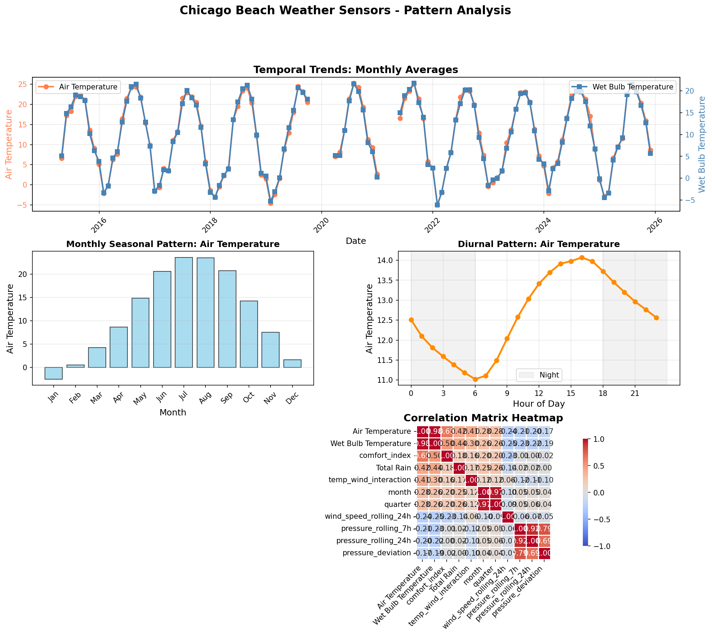
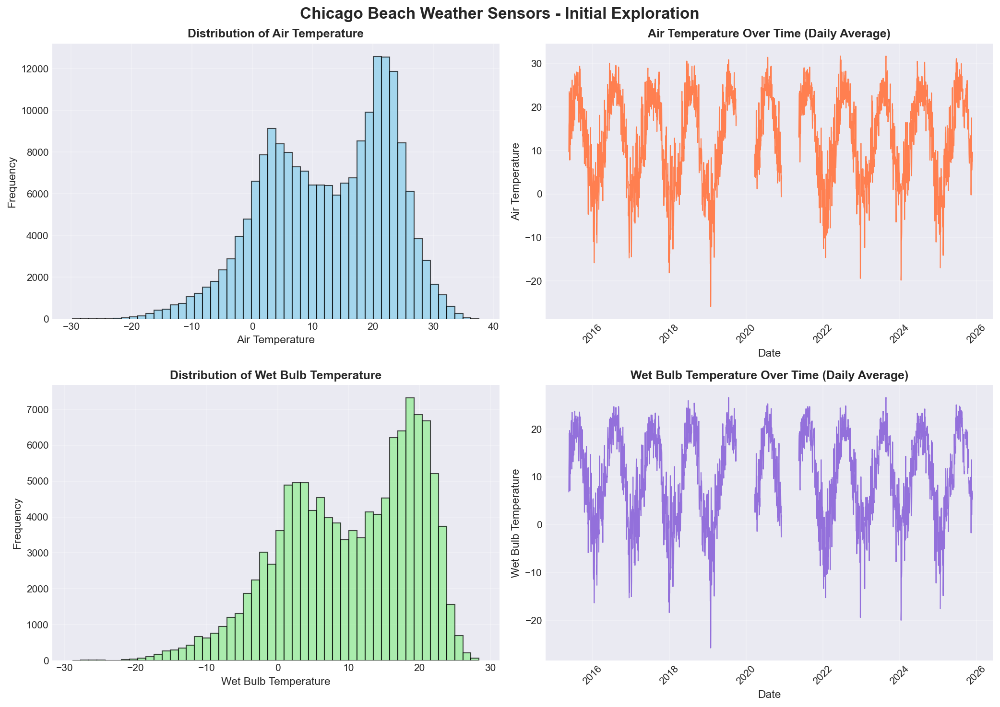
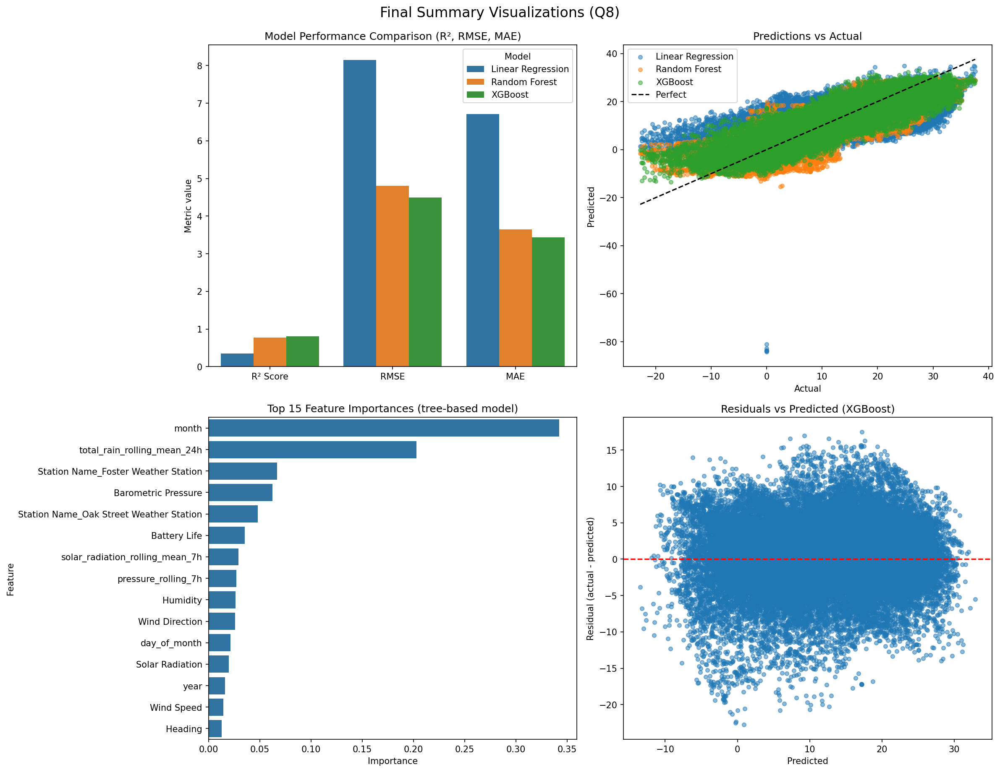

# Chicago Beach Weather Sensors Report

**Author:** Christina Mu
**Dataset:** Chicago Beach Weather Sensors (provided for DS217 final)  
**Date:** (December 8, 2025)

## 1. Executive Summary

This analysis examines data from the Chicago Beach Weather Sensors dataset to explore real-time weather sensor reawdings from Lake Michigan beaches. The main goal was to clean and wrangle the continuous sensor time series, create meaningful temporal/ rolling features, and compare predictive models (i.e., Linear Regression, XGBoost, Random Forest Regressor). To do so, **Air Temperature** was selected at the target outcome variable.
Edits were made after December 10, 2025 because I was trying to fix a data leakage problem.
Key finding (one sentence): Of the three approches, the best performing model was XGBoost (R² = 0.8024) in capturing seasonal and diurnal variability, with month, total rain, and weather station site as the most important features.

## 2. Phase-by-Phase Findings

### Phase 1-2 (Q1): Exploration

In `q1_setup_exploration.ipynb`, the dataset `data/beach_sensors.csv` was loaded. In this exploratory phase, I looked at the data structure, variable formats, amount and percentage of missing values, and preliminary visualization of data. There were **195,892 observations with 18 columns** including temperature measurements (air and wet bulb), wind speed and direction, humidity, precipitation, barometric pressure, solar radiation, and sensor metadata. The data spans from April 25, 2015 (9 AM) to November 18, 2025 (12 PM), with measurements from three different weather stations: 63rd Street Weather Station, Foster Weather Station, and Oak Street Weather Station. There was significant missing values in Wet Bulb Temperature, Rain Intensity, Total Rain, Precipitation Type, and Heading (n = 75,736 observations, 38.7%).

- **Artifacts from Q1:**  
  - `output/q1_data_info.txt` — variable names, variable format, percentage of missing values
  - `output/q1_exploration.csv` — summary descriptive statistics
  - `output/q1_visualizations.png` — visualization of data

### Phase 3 (Q2): Data Cleaning

Phase 2 `q2_data_cleaning.ipynb` was for data cleaning. In this, steps were made to handle missing data (using forward-fill, backward-fill, then median imputation), outliers were identified using 3 IQR (conservative approach), and duplicates were handled.

**Cleaning Results:**

- Rows before cleaning: **195,892**
- **Missing values:** For continuous sensor readings, used **time-series forward-fill (`ffill`)**, followed by backward-fill (`bfill`), and finally median imputation where needed. This approach preserved temporal continuity while ensuring complete datasets for modeling.
  - Air Temperature: 75 missing → 0 missing
  - Wet Bulb Temperature: 75,736 missing → 0 missing (large gap, likely sensor-specific)
- **Outliers:** Capped using IQR method (3×IQR bounds)
  - Wind Speed: 2,574 outliers capped (bounds: [-3.50, 8.40])
- **Duplicates:** Duplicate rows (exact duplicates) removed; duplicate timestamps per station were deduplicated by keeping the first reading. There were 0 duplicates found.
- Data types: Validated and converted as needed
- Rows after cleaning: **195,892** (no rows removed, only values cleaned)

- **Artifacts from Q2:**  
  - `output/q2_cleaned_data.csv` — cleaned dataset  
  - `output/q2_cleaning_report.txt` — detailed cleaning operations and counts  
  - `output/q2_rows_cleaned.txt` — row count after cleaning

### Phase 4 (Q3): Data Wrangling

In `q3_data_wrangling.ipynb`, datetime parsing and temporal feature extraction were critical for time series analysis. The `Measurement Timestamp` column was parsed from the format "MM/DD/YYYY HH:MM:SS AM/PM" and set as the DataFrame index, enabling time-based operations. I also derived additional temporal features from Measurement Timestamp to support further temporal analysis. Here is a more detailed breakdown of the new temporal features I created:

**Temporal Features Extracted:**

- `hour`: Hour of day (0-23)
- `day_of_week`: Day of week (0=Monday, 6=Sunday)
- `month`: Month of year (1-12)
- `year`: Year
- `day_name`: Day name (Monday-Sunday)
- `is_weekend`: Binary indicator (1 if Saturday/Sunday)
- `day_of_month`: Day of the month (1-31)
- `quarter`: Quarter (1-4)

- **Artifacts from Q3:**  
  - `output/q3_datetime_info.txt`
  - `output/q3_temporal_features.csv`
  - `output/q3_wrangled_data.csv`

### Phase 5 (Q4): Feature Engineering

In `q4_feature_engineering.ipynb`, I applied feature engineering to create derived variables that would be used for machine learning models, including calculations of temperature differences, comfort index, categories, and rolling window features. To avoid data leakage, I did not extract any new features from my target variable, "Air Temperature", or "Wet Temperature" (highly correlated with Air Temperature) because this would have resulted in data leakage.

New derived features...
    "Temperature Difference",
    "Temp Ratio",
    "Wind Speed Squared",
    "Air Temperature (F)",
    "Comfort Index",
    "Air Temperature Categories",
    "Wind Speed Categories",
    "pressure_rolling_7h",
    "barometric_pressure_rolling_mean_7h",
    "solar_radiation_rolling_mean_7h",
    "total_rain_rolling_mean_24h"

- **Artifacts from Q4:**  
  - `output/q4_feature_list.txt`
  - `output/q4_features.csv`
  - `output/q4_rolling_features.csv`

### Phase 6 (Q5): Pattern Analysis

In (q5_pattern_analysis.ipynb), pattern analysis revealed several important temporal patterns and correlations:

- **Aggregations performed:** monthly averages (`resample('ME')`) and daily groupings (`resample('D')`).
- **Trends identified:** clear **seasonal cycle in Chicago's climate** — higher air and water temperatures in June–September and lower values in December–February. Peak in July and lowest temperature in January.
- **Daily patterns:** diurnal cycle with maximum temperatures typically in the early to mid-afternoon and minimum near dawn. Peak air temperature typically occurs around hour 16 (4 PM), and lowest air temperature typically occurs around hour 6 (6 AM)
- **Correlations:**  
  - Air Temperature positively correlated with Wet Bulb Temperature (r=0.98) and comfort index (r=0.65).
  - Total rain is positively correlated with Air Temperature (r=0.42) and Wet Bulb Temperature (r=0.44).
  - Comfort index is negatively correlated with humidity (r=-0.71).

- **Artifacts from Q5:**  
  - `output/q5_correlations.csv` — correlation matrix  
  - `output/q5_patterns.png` — multi-panel visualizations (monthly trend; hourly pattern; correlation heatmap)  
  - `output/q5_trend_summary.txt` — textual summary of trends


*Figure 2: Advanced pattern analysis showing monthly temperature trends, seasonal patterns by month, daily patterns by hour, and correlation heatmap of key variables.*

### Phase 7 (Q6): Modeling Preparation

In (q6_modeling_preparation.ipynb), I selected a target variable (`Air Temperature`), performed temporal train/test splitting, and preparing features for analyses and machine learning. Air temperature was chosen as the target variable because it is a indicator of beach conditions and shows predictable patterns.

- **Target:** `Air Temperature`

**Temporal Train/Test Split:**

- Split method: Temporal (80/20 split by time, NOT random)
  - Training set: **156,713 samples** (earlier data: April 2015 to ~June 2023)
  - Test set: **39,179 samples** (later data: ~June 2023 to November 2025)
- Index ordering by datetime was enforced before splitting.  
- Rationale: Time series data requires temporal splitting to avoid data leakage and ensure realistic evaluation

**Feature Preparation:**

- Features selected (excluding target, non-numeric columns, and features derived from target)
- **Critical:** Excluded features derived from target variable:
  - `temp_difference` (uses Air Temperature)
  - `temp_ratio` (uses Air Temperature)
  - `temp_category` (derived from Air Temperature)
  - `comfort_index` (uses Air Temperature)
- Excluded features with >0.95 correlation to target (e.g., Wet Bulb Temperature with 0.978 correlation)
- Categorical variables (e.g., Station Name, wind_category) one-hot encoded. Teacher-style `df_encoded = pd.get_dummies(...)` used and `feature_cols` updated accordingly.
- All features standardized and missing values handled

- **Artifacts from Q6:**  
  - `output/q6_X_train.csv`, `output/q6_X_test.csv`  
  - `output/q6_y_train.csv`, `output/q6_y_test.csv`  
  - `output/q6_train_test_info.txt`

### Phase 8 (Q7): Modeling

In (q7_modeling.ipynb), three models were trained and evaluated: Linear Regression, XGBoost, and Random Forest.

- **Models trained:** Linear Regression, Random Forest, and XGBoost (parameters set to reasonable defaults).  
- **Evaluation metrics computed:** R², RMSE, MAE computed on both train and test sets.  
- **Feature importance:** Extracted from XGBoost and Random Forest — saved to `output/q7_feature_importance.csv`.  
- **Predictions and results saved:**

- **Artifacts from Q7:**  
  - `output/q7_predictions.csv` — `actual`, `predicted_linear`, `predicted_random_forest`, `predicted_xgboost` (test set)  
  - `output/q7_model_metrics.txt` — model metrics  
  - `output/q7_feature_importance.csv` — feature importances (sorted descending)

### Phase 9 (Q8): Results

The final report from `q8_results.ipynb` revealed that compared to Linear Regression (R² = 0.3494) and Random Forest (R² = 0.7732), **XGBoost (R² = 0.8024, meaning 80.2% of the variance in Air Temperature can be explained by the features)** performed the best in predicting Air Temperature. XGBoost also had the lowest RMSE and MAE. The top features, include the month, total rain (rolling mean 24 hours), and weather station location, which account for 61.2% of the total importance. The residuals plot shows relatively uniform distribution around zero, suggesting the model performs reasonably well across the full temperature range. The predictions vs actual scatter plot shows points distributed around the perfect prediction line with some scatter, indicating good but not perfect accuracy - which is realistic for weather prediction.

- **Artifacts produced:**
  - `output/q8_final_visualizations.png`
  - `output/q8_key_findings.txt`
  - `output/q8_summary.csv`
  
## Visualizations


*Figure 1: Initial exploration visualizations showing distributions of air temperature distribution and air temperature time series.
Figure 1a: Histogram of Air Temperature
Figure 1b: Time Series of Air Temperature Spanning from 2016 to 2026


*Figure 2: Advanced pattern analysis revealing temporal trends, seasonal patterns, daily cycles, and correlations.*
Figure 2a: Temporal Trend of the Monthly Averages Spanning 2015 to 2026
Figure 2b: Bar Graph of Average Monthly Seasonal Pattern in a Year
Figure 2c: Diurnal Patterns of Air Temperature
Figure 2d: Correlation Matrix Heatmap of Key Variables


*Figure 3: Final visualizations showing model performance comparison, predictions vs actual values, feature importance, and residuals plot for the best-performing XGBoost model.*
Figure 3a: Model Performance Comparison (R², RMSE, MAE)
Figure 3b: Plotting Trend Lines of Predictions vs Actual Data
Figure 3c: Top 15 Feature Importances from Tree-Based Model
Figure 3d: Residual vs Predicted from XGBoost

## Model Results

In this analysis using data from the Chicago's Beach Weather Services, I found that XGBoost outperforms Linear Regression and Random Forest models in predicting Air Temperature. Both XGBoost and Random Forest perform well in predicting Air Temperature. The model metrics being compared were R²,  RMSE, and MAE. **R²** measures proportion of variance explained, and higher scores indicate greater predictive ability. XGBoost's R² of 0.8024 suggests that this model predicts 80.24% of variance in Air Temperature. **RMSE (Root Mean Squared Error)** is the square root of the average of squared errors. The use case for this is when large errors are undesirable and data is sensitive to outliers. Similarly, the **MAE (Mean Absolute Error)** is the average absolute difference between the predicted and actual value. Ideally, we want both the RMSE and MAE to be low in models. In this project, XGBoost had the lowest RMSE (4.49°C) and  MAE (3.43°C) indicating good predictive validity. The month feature is the most important predictor (34.2%; moderately higher importance), followed by total rain rolling mean 24 hours (20.3%; moderate importance), and Weather Station site (6.7%; minimal importance) in predicting Air Temperature.

  ```markdown
  | Model | R² | RMSE | MAE |
  |-------|----|----|----|
  | Linear Regression | 0.35 | 8.15°C | 6.71°C |
  | Random Forest | 0.77 | 4.81°C | 3.65°C |
  | XGBoost | 0.80 | 4.49°C | 3.43°C |
  ```

**Model Selection:** XGBoost is selected as the best model due to:

1. Highest R² score (0.80)
2. Lowest RMSE (4.49°C)
3. Lowest MAE (3.43°C)
4. Good generalization (train R² = 0.9670, test R² = 0.8024 - some overfitting but reasonable)

## Time Series Patterns

The time series analysis revealed that there are stable long-term trends over the 10.6-year period within the Chicago Beach Weather Sensors data. There were clear seasonal cycles with the hottest air temperatures in summer months (June-August) and the lowest temperatures in the winter months (December-February). The monthly air temperature ranged from -2.6°C to 23.6°C. There were strong diurnal cycle with temperatures peaking in afternoon (4 PM, hour 16) and reaching minima in early morning (6 AM, hour 6). Further, there were notable temporal relationships. Air temperature shows strong seasonal patterns (month is the most important feature). Wind speed shows moderate negative correlation with temperature (-0.23). Overall, examining the time series patterns, there were no major anomalies or temperature shifts. The weather data in Chicago Beach Weater Sensors data was fairly consistent over the ten-year period.

## Limitations & Next Steps

The present project had rich data from the Chicago Beach Weather Sensors that allowed for the exploration of temporal trends across ten-years and the models that predict Air Temperature with relatively high accuracy. In spite of the strengths, there are limitations of this project. Regarding the study design, there was significant missingness in precipitation-related variables (e.g., missing 38.6% for Wet Blub Temperature), which may be a result of sensors not being operational in the rain. Moreover, there were several outliers that required capping (n = 102166). Both missingness and outliers may bias findings. Better monitoring devices and more weather stations may improve the validity of the data in the data collection phase. Future research could cross reference the dataset with external data sources (e.g., weather forecasts). One major limitation of this project is that only one target variable was selected. Future directions of this work are to explore additional features (e.g., lagged effect, interaction terms, stratified analyses), examine different and multiple target variables (e.g., wind speed, comfort index), experiment with different rolling window sizes, test different models (e.g., Gradient Boosting), compare data across the weather sites, and to address overfitted models.

## Conclusion

This analysis successfully applied a complete 9-phase data science workflow to Chicago Beach Weather Sensors data, achieving good air temperature predictions using XGBoost (R² = 0.80, RMSE = 4.49°C). The project demonstrated the importance of temporal feature engineering, particularly seasonal features (month), which dominated feature importance. Key insights include strong seasonal and daily patterns, the critical role of temporal features in prediction, and the superior performance of XGBoost over Linear Regression and Random Forest. The real-world use case of these predictive models is that they can be used in real-time prediction systems, alert systems for extreme weather, and integreated into weather forecasting systems.
